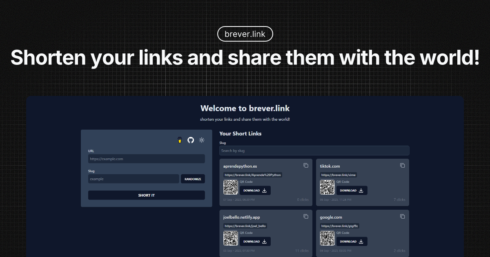

# brever.link — URL Shortener

<!-- add image cover -->
<figure>
  
</figure>

Application for shortening URLs with QR code generation, click counting, search, and pagination. Built with Astro 5, React, Tailwind CSS 4, and Astro DB, ready to deploy on Netlify.

## Demo

- Site: https://brever.link

## Features

- Create short links with custom slugs.
- Automatic QR code generation (base64 Data URL) for each link.
- Redirection via middleware and click counter by slug.
- Listing with slug search and server-side pagination.
- Validation with Zod and React Hook Form, toasts with Sonner.
- Light/dark mode and UI with Tailwind CSS 4.

## Technical Stack

- Astro 5 (output: server) + @astrojs/netlify
- React 19 + @astrojs/react
- Tailwind CSS 4 (via @tailwindcss/vite)
- Astro DB (@astrojs/db) for persistence
- Astro Actions for server-side operations
- QRCode (qrcode) for QR code generation

## Project Structure

```
db/
    config.ts            # Astro DB configuration (tables)
    seed.ts              # Seed data (pending implementation)
    tables/
        link.table.ts      # LinkTable definition
src/
    actions/             # Astro Actions (definition and handler)
    components/          # React/Astro components (UI)
    helpers/             # Utilities (classes, dates, etc.)
    layouts/             # Astro layouts
    pages/               # Astro pages (home, listing)
    schemas/             # Zod schemas (form/action/filter)
    services/            # DB services (CRUD, pagination, counters)
    middleware.ts        # Redirection logic + click increment
public/                # Static assets
```

Main table `LinkTable` (fields):

- id (text, PK)
- url (text)
- slug (text, unique)
- shortLink (text)
- createdAt (date)
- clickCount (number, default 0)
- qrCode (text, optional)

## Requirements

- Node.js 18.17+ (recommended 20+)
- pnpm 8+

## Setup

1. Install dependencies

```powershell
pnpm install
```

2. Initialize database (local)

```powershell
# Push schema to local DB
pnpm astro db push
```

3. Run in development

```powershell
pnpm dev
```

The app will open at http://localhost:4321 (Astro's default).

4. Build and preview

```powershell
pnpm build
pnpm preview
```

Notes on remote DB:

- There are scripts for working with remote DB: `pnpm dev:remote`, `pnpm push:db` (uses `astro db push --remote`). Remote configuration depends on your provider/environment and variables you configure. Check Astro DB documentation for the remote flow on your deployment platform.

## Available Scripts

- `pnpm dev` — Starts development environment.
- `pnpm dev:remote` — Dev oriented to remote DB (if configured).
- `pnpm build` — Builds the project for production.
- `pnpm preview` — Serves the build locally.
- `pnpm astro` — Direct access to Astro CLI.
- `pnpm lint` — Formats with Prettier.
- `pnpm lint:check` — Checks code formatting without making changes.
- `pnpm lint:eslint` — Runs ESLint linting checks.
- `pnpm lint:eslint:fix` — Runs ESLint with automatic fixes.
- `pnpm lint:fix` — Formats with Prettier and runs ESLint with fixes.
- `pnpm push:db` — `astro db push --remote`.
- `pnpm test` — Runs tests in watch mode.
- `pnpm test:run` — Runs all tests once.
- `pnpm test:coverage` — Runs tests with coverage report.
- `pnpm test:ui` — Opens Vitest web interface.

## Shortening and Redirection Flow

1. The form (`ShortLinkForm.tsx`) validates with Zod and sends data to an Astro Action.
2. The action (`shorten.actions.ts`) uses the `shorLink` handler (`shorten.service.ts`):
   - Verifies slug duplication.
   - Generates `shortLink` and `qrCode` (with `qrcode`).
   - Inserts the record in `LinkTable`.
3. The `middleware.ts` intercepts `/{slug}` routes:
   - Looks for the link, increments `clickCount` and redirects (302) to `url`.

## Pagination and Search

- `getAllPaginatedLinks(page, limit, slug)` filters by `slug` match and paginates results. In `index.astro`, `limit = 4` is used and `page` and `search` parameters from the URL are validated.

## Testing

The project includes comprehensive testing with **261 tests** across **15 test files** achieving **perfect 100% coverage**:

- **React Components**: Complete UI component testing with user interactions (128 tests)
- **Business Logic**: Services, middleware, and data operations (53 tests)
- **Schema Validation**: Zod validation for forms and API actions (29 tests)
- **URL Security**: Comprehensive URL validation with security checks (29 tests) - HTTPS-only, private IP blocking
- **Utilities**: Helper functions and edge case handling (18 tests)

### Coverage Metrics

- **Statements**: 100% coverage
- **Branches**: 100% coverage
- **Functions**: 100% coverage
- **Lines**: 100% coverage

Run tests with:

```powershell
# Watch mode for development
pnpm test

# Run all tests once
pnpm test:run

# Coverage report
pnpm test:coverage

# Web interface
pnpm test:ui
```

For detailed testing documentation, see [TEST_README.md](./TEST_README.md).

## Code Quality & Git Hooks

This project uses **Husky** to enforce code quality standards through Git hooks:

### Pre-commit Hook

Automatically runs before each commit to ensure code quality:

- **Code Formatting**: Runs Prettier to fix formatting issues (`pnpm lint:fix`)
- **Format Check**: Verifies code formatting is consistent (`pnpm lint:check`)
- **ESLint**: Performs linting checks on TypeScript, JSX, and Astro files (`pnpm lint:eslint`)

### Commit Message Hook

Validates commit messages follow [Conventional Commits](https://www.conventionalcommits.org/) format:

- Uses **commitlint** with `@commitlint/config-conventional`
- Enforces structured commit messages for better project history
- See [COMMIT_CONVENTIONS.md](./COMMIT_CONVENTIONS.md) for detailed rules

### Quality Standards

- **ESLint Configuration**: Custom rules for TypeScript, React, and Astro files
- **Prettier**: Consistent code formatting across the project
- **TypeScript**: Strict type checking with custom rules
- **Testing**: Comprehensive test suite with 261 tests across 15 files achieving perfect 100% coverage

### Bypassing Hooks (Emergency Only)

```powershell
# Skip pre-commit hook (not recommended)
git commit --no-verify -m "emergency fix"

# Skip commit-msg validation (not recommended)
git commit --no-verify -m "fix: emergency commit"
```

## Deployment

- Adapter: `@astrojs/netlify`.
- Define necessary variables/credentials for your remote DB in Netlify if you use them. Then build and publish with Netlify commands (build: `pnpm build`).

## Suggested Next Steps

- Implement `db/seed.ts` with example data.
- Add endpoint/action to delete/edit links if management is required.
- Consider implementing rate limiting for URL shortening.
- Add analytics dashboard for link performance tracking.

## License

[MIT](https://opensource.org/licenses/MIT)
